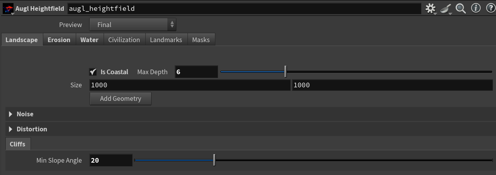

# houdini-talespire
AUGL HTT is a series of Houdini tools built on top of [Baldrax's Houdini
TaleSpire
Terrain Generation
Toolset](https://github.com/Baldrax/Houdini_TaleSpire_Terrain_Generation_Toolset).
The aim is to provide a series of tools that make the aforementioned tools more
accessible to those not familiar with Houdini.

## Augl Heightfield

An Augl Heightfield node is the core of this toolset. The different tabs have
the settings to control different stages of map generation.

### Landscape
This tab defines the base heightfield of the map. All distance units used within
the tool, inclusive of height, are equivalent to 1 TaleSpire unit. This
typically means that 1 unit translates to 5 feet measured.

| Field | Use |
|-|-|
| Is Coastal | When checked the base heightfield is depressed by `Max Depth` units.  |
| Max Depth | For coastal maps this is the max depth of the coastal bodies of water. |
| Size | Number of tiles the map represents along the xz plane. |
| Add Geometry | Clicking this will take you to a sub node that allows you to modify the base geometry if desired. |

#### Add Geometry
Heightfields can be generated through manually editing the geometry, using
random noise, or through a combination of the two. If you wish to use a purely
random approach this step is unnecessary.

In this example we see a series of curves that are fed into an `AUGL Topology`
node that is then projected onto the heightfield to create the base heights
resulting in the heightfield seen below.

#### Noise
Noise adds y value randomness to the heightfield.

| Field | Use |
|-|-|
| Combine Method | The method used when applying noise to the heightfield. Replace ignores the existing heightfield and sets a new value. Do not use this method when manually creating a base heightfield. The other methods preserve the base and modify it by the noise field. In this case a smaller amplitude tends to work best. |
| Amplitude | Maximum modification value. |
| Element Size | How much real estate along the xz plane that a distortion occupies. Larger values result in smoother change, smaller more jagged. |

#### Distortion
Distortion adds randomness to the heightfield along the xz plane. The options
here are the same as in `Noise`.

#### Cliffs
Defines the angle at which the terrain transitions from ground to cliff.

### Erosion

Erosion provides the settings to simulate natual erosion along the heightfield.
This takes the blocky version generated in `Landscape` and makes it appear more
organic.

#### Erosion
When the `Enable` checkbox is checked an erosion simulation is applied to the
heightfield. This makes the heightfield appear more organic.

#### Slump
When the `Enable` checkbox is checked an slump simulation is applied to the
heightfield. This makes cliff bases appear more organic.

### Water

AUGL defines coastal water into 4 zones, `Tidal`, `Shallows`, `Coastal`,
`Depths`. The tool allows for the definition of the `Tidal`, `Shallows`, and
`Coastal` zones. Anything below sea level not included within these zones is
considerd `Depths`. These zones are provided so large maps can easily represent
large diverse bodies of water.

### Civilization
This tab offers two options `Add Towns` and `Add Roads`. Clicking either of
these takes you to a subnode where towns and roads can be added.

#### Towns

Adding a town consists of two steps.

1. Creating a bounding curve.
2. Feeding this curve and the heightfield into an `AUGL Town` node.

The output from the `AUGL Town` is a modified terrain heightfield and a
civilization heightfield. This is done so the heightfields can be rendered
seperately so support features like cliff over hangs or boardwalks above marshy
terrain.

#### Roads
Adding roads works the same as adding a town with few exceptions.

1. The input curve is expected to not be closed.
2. An `AUGL Road` is used in place of an `AUGL Town`.

### Landmarks

### Masks
The `Masks` tab provides values for masks generated by AUGL. These masks define
terrain zones for tiling and prop scattering. Each zone below has a generic mask
for tiles generated along with a flora, fauna, debris, and trees masks for
prop scattering.

#### Nil
The area where tiles should not be placed. This is mose often when a
civilization object will be placing tiles that would intersect or be placed
under the base heightfield.

#### Ground
The base ground.

#### Cliffs
Zone where terrain moves from ground to cliffs.

#### Cliffs Shear
Zone where cliffs are incredibly steep. This should be primarially the cliff
walls to scatter.

#### Terrain Under Road
Terrain that should be rendered but is located under a raised road.

#### Terrain Under Town
Terrain that should be rendered but is located under a raised town.

#### Water Tidals
Where the land meets the sea. Typically tide pools, where reeds grow, etc.

#### Water Shallows

#### Water Coastals

#### Water Depths

